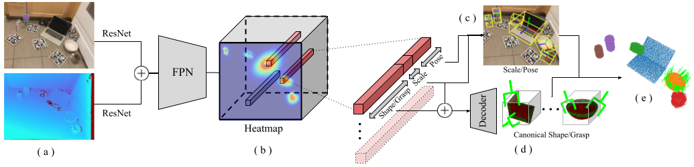
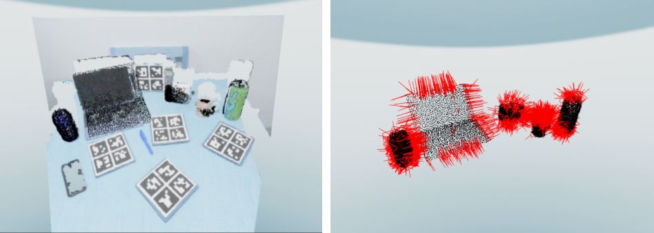

# SceneGrasp

<strong>Real-time Simultaneous Multi-Object 3D Shape Reconstruction, 6DoF Pose Estimation and Dense Grasp Prediction</strong>
<br>
[[Project Page]](https://samsunglabs.github.io/SceneGrasp-project-page) [[ArXiv]](https://arxiv.org/abs/2305.09510)
<br>
[Shubham Agrawal](https://www.agshubh.com), [Nikhil Chavan-Dafle](https://www.linkedin.com/in/nikhilcd),
[Isaac Kasahara](https://kasai2020.github.io/), [Selim Engin](https://ksengin.github.io/),
[Jinwook Huh](https://sites.google.com/view/jinwookhuh/), [Volkan Isler](https://www-users.cse.umn.edu/~isler/)
<br>
[Samsung AI Center, New York](https://research.samsung.com/aicenter_ny)


<p float="left" align="center">
  <a href="https://youtu.be/R38v8y3GXn8"></a>
  <a href="https://youtu.be/wFdet1xfunA"></a>
</p>




## Table of contents:
1. [Setup environment](#setup-environment)
2. [Inference](#inference)
3. [Training](#training)
4. [Citation](#citation)

## Setup environment
Install the python dependencies

```
conda create --prefix ./pyvenv python=3.8
conda activate ./pyvenv
pip install -r requirements.txt
pip install git+https://github.com/facebookresearch/pytorch3d.git@stable
```

Setup the environment by running following commands from the project root:
```
export PYTHONPATH=${PYTHONPATH}:${PWD}
WANDB_MODE="disabled"
```

Optionally, to enable html gif visualizations, install
[gifsicle](https://www.lcdf.org/gifsicle/).

## Inference Demo
Download [pre-trained checkpoints](https://github.com/SamsungLabs/SceneGrasp/releases/download/v1.0/checkpoints.zip)
and unzip them at the project root.
Run demo using following script:
```python
python scripts/demo.py
```
This script loads the pretrained checkpoints and shows the results on a
[small-subset of the NOCS-Real-Test set](outreach/demo_data/). For every input, it first
shows the predicted shapes and then it shows the predicted grasps, as shown below.



Please refer to the [SceneGraspModel](common/utils/scene_grasp_utils.py)
class for running on your own data (RGB, Depth, camera_K).

## Training
There are two major steps for training this:
- Data generation and training of scale-shape-grasp-auto-encoder. [See instructions here](scene_grasp/scale_shape_grasp_ae/README.md).
- Data generation and training of SceneGraspNet.
[See instructions here](scene_grasp/scene_grasp_net/README.md).


## Acknowledgement
SceneGraspNet code is adapted from [Centersnap](https://github.com/zubair-irshad/CenterSnap)
and [object-deformnet](https://github.com/mentian/object-deformnet) implementations. We
sincerely thanks the authors for providing their implementations.

## Citation
```
@inproceedings{
  agrawal2023realtime,
  title={Real-time Simultaneous Multi-Object 3D Shape Reconstruction, 6DoF Pose Estimation and Dense Grasp Prediction},
  author={Shubham Agrawal and Nikhil Chavan-Dafle and Isaac Kasahara and Selim Engin and Jinwook Huh and Volkan Isler},
  booktitle={{IEEE/RSJ International Conference on Intelligent Robots and Systems (IROS)}},
  year={2023}
}
```